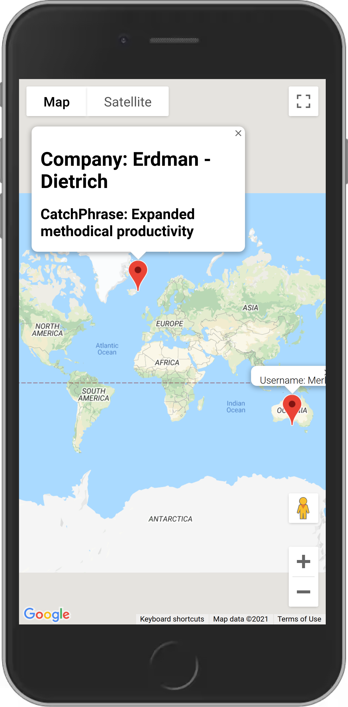

# :artificial_satellite: WhereAmI

Important typescript conepts covered in this project:

- Restrict the amount of API surface area exposed inside src/index.ts
- Interface implementation and usage as an argument.
- Generate instances from factory.

## :round_pushpin: Preview

